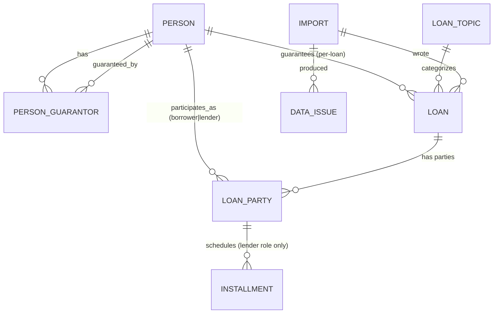

# System Design — Borrowing Network Dashboard (Phase 1)

Companion to [SPEC.md](SPEC.md). This document is the locked architecture and data design for the read-only dashboard + Excel-import phase.

---

## 1. Decisions Log

All architecture-shaping questions resolved:

| # | Decision |
|---|---|
| Refresh model | Admin uploads new `.xlsm` files via admin panel and clicks **Re-import**. Importer per-year-replaces only the years found in uploaded files. |
| Person identity | **Phone number only** (`national_code` not in current Excel — kept as nullable column for future). Names not used as keys. |
| Cross-year roll-ups | Year-scoped data (loans, contributions, installments) but **person is global** — same phone across years = same Person record. |
| Persons retention | **Never deleted by re-import.** Only Loan/Contribution/Installment rows for the imported years are replaced. |
| Bulk seeding | Admin can upload **multiple xlsm files at once** in admin panel. Each becomes its own `Import` record, processed sequentially. |
| Currency | All amounts are in **million toman**. Stored as `numeric(18,3)` to preserve fractions like `5.5`. |
| Topics | **Global catalog**, not year-scoped. |
| Liaison (`رابط`) | Free text, but rendered as autocomplete filter facet (distinct values). |
| Verification (`تایید`) | Mapped to `is_verified` boolean. Used as a filter only. |
| Inconsistencies | Surfaced in **Data Quality page** in admin panel. Excel remains the source of record; no in-DB corrections. |
| Auth | Single shared password via NGINX Basic Auth in front of stack. |
| Mobile | First-class. Mobile-first responsive. |
| Language | **Fully Persian (fa-IR), RTL only.** No English/Arabic UI. All page titles, labels, buttons, error messages, status badges, empty states, tooltips in Persian. Dates Jalali. Numbers Persian numerals by default. Backend identifiers (DB columns, code, API JSON keys) stay English; only the rendered UI is Persian. |
| Loan participants | **N-to-N on both sides.** A single loan can have multiple borrowers and multiple lenders. Schema uses one `loan_party` table with `role` (`borrower` / `lender`) + `amount`. Invariant: `Σ borrower amounts = Σ lender amounts = loan.total_amount`. (Current Excel has 1 borrower / N lenders; importer emits 1 borrower-party row + N lender-party rows. Schema future-proof.) |
| Exports | None. Screen only. |
| Volume | ~10k persons, 10k–100k loans/year, multiple years history. Live aggregates fine; no materialized views needed yet. |
| Phone normalization | Yes — canonical form on import (`+98XXXXXXXXXX` if Iranian, raw stored alongside). |

---

## 2. C4 — Container Diagram

```
                       ┌────────────────────────────┐
                       │  NGINX (TLS + Basic Auth)  │
                       └──────────┬─────────────────┘
                                  │
                  ┌───────────────┴───────────────┐
                  ▼                               ▼
          ┌──────────────┐                 ┌──────────────┐
          │  web         │                 │  api         │
          │  Next.js 15  │ ── /api/* ────▶ │  FastAPI     │
          └──────────────┘                 └──────┬───────┘
                                                  │
                                          ┌───────┴───────┐
                                          ▼               ▼
                                    ┌──────────┐   ┌─────────────┐
                                    │ postgres │   │ uploads/    │
                                    │ (volume) │   │ (.xlsm bind │
                                    └──────────┘   │  mount)     │
                                                   └─────────────┘
```

Single Docker Compose file. NGINX gates everything with one shared password. No multi-tenant, no member self-service, no external integrations.

---

## 3. Data Model (final)

### 3.1 Tables

```sql
-- Person (global, identity = phone)
person
  id              bigserial PK
  phone           text  UNIQUE NOT NULL          -- canonicalized
  phone_raw       text                            -- as appearing in xlsm
  national_code   text  UNIQUE                    -- nullable, future-proof
  full_name       text  NOT NULL
  messenger       text
  is_verified     bool  NOT NULL DEFAULT false
  created_at      timestamptz NOT NULL DEFAULT now()
  updated_at      timestamptz NOT NULL DEFAULT now()
  -- Indexes:
  -- gin (full_name gin_trgm_ops)              -- fuzzy Persian search
  -- btree (phone), btree (national_code)

person_guarantor
  person_id       bigint FK person(id)
  guarantor_id    bigint FK person(id)
  role            text   CHECK in ('main','secondary_2','secondary_3','secondary_4')
  PRIMARY KEY (person_id, role)

-- Topic catalog (global)
loan_topic
  id              serial PK
  legacy_num      int                              -- موضوعات.num
  name            text   UNIQUE NOT NULL
  created_at      timestamptz NOT NULL DEFAULT now()

-- Loan (year-scoped)
loan
  id              bigserial PK
  persian_year    smallint NOT NULL
  loan_number     text  NOT NULL                   -- "1500", "2500", ...
  channel_number  text                              -- nullable
  guarantor_id    bigint FK person(id)              -- per-loan guarantor (1405+)
  liaison_label   text                              -- free text
  topic_id        int   FK loan_topic(id) NOT NULL
  total_amount    numeric(18,3) NOT NULL            -- million toman; = Σ borrower-side = Σ lender-side
  description     text
  import_id       bigint FK import(id) NOT NULL
  created_at      timestamptz NOT NULL DEFAULT now()
  UNIQUE (persian_year, loan_number)
  -- Indexes:
  -- btree (topic_id), btree (persian_year),
  -- btree (liaison_label), btree (guarantor_id)

-- Participants on a loan (N-to-N: any number of borrowers and any number of lenders)
loan_party
  id              bigserial PK
  loan_id         bigint FK loan(id) ON DELETE CASCADE NOT NULL
  person_id       bigint FK person(id) NOT NULL
  role            text NOT NULL CHECK (role IN ('borrower','lender'))
  amount          numeric(18,3) NOT NULL
  display_order   smallint NOT NULL
  UNIQUE (loan_id, role, person_id)                 -- a person plays each role at most once per loan
  -- Indexes:
  -- btree (person_id, role)
  -- btree (loan_id, role)

-- Installments (Phase 1: only attached to lender parties — i.e. the lender's repayment receipts)
-- Schema allows future per-borrower schedules without migration.
installment
  id                   bigserial PK
  loan_party_id        bigint FK loan_party(id) ON DELETE CASCADE NOT NULL
  due_persian_year     smallint NOT NULL
  due_persian_month    smallint NOT NULL CHECK (due_persian_month BETWEEN 1 AND 12)
  due_day_of_month     smallint NOT NULL CHECK (due_day_of_month BETWEEN 1 AND 31)
  amount               numeric(18,3) NOT NULL
  status               text NOT NULL CHECK (status IN ('paid','unpaid'))
  -- Indexes:
  -- btree (loan_party_id, status)
  -- btree (due_persian_year, due_persian_month) WHERE status='unpaid'  (overdue scan)

-- Imports & data quality
import
  id              bigserial PK
  uploaded_at     timestamptz NOT NULL DEFAULT now()
  source_sha256   text   UNIQUE NOT NULL
  source_filename text   NOT NULL
  years_imported  smallint[] NOT NULL
  status          text   NOT NULL CHECK in ('pending','running','success','failed')
  duration_ms     int
  report          jsonb  NOT NULL DEFAULT '{}'      -- summary counts
  error_message   text                               -- on failure

data_issue
  id              bigserial PK
  import_id       bigint FK import(id) ON DELETE CASCADE NOT NULL
  severity        text   NOT NULL CHECK in ('error','warning','info')
  category        text   NOT NULL                    -- broken_ref|total_mismatch|...
  sheet           text
  cell            text                                -- e.g. "سال 1404!O5"
  message         text   NOT NULL
  context         jsonb
  -- Indexes:
  -- btree (import_id, severity)
```

### 3.2 ER (Mermaid)



### 3.3 Phone canonicalization rule

On import:
- Strip whitespace, dashes, parens.
- If input starts with `0` and length 11 → assume Iranian mobile, canonical = `+98` + drop leading `0`.
- If input starts with `+98` → keep.
- If input starts with `98` and length 12 → prepend `+`.
- Else → store as-is, flag a `data_issue` warning (`unknown_phone_format`).

`phone_raw` always preserves the original string for traceability.

---

## 4. Importer

### 4.1 Trigger paths
- **Web admin:** drag-drop one or more `.xlsm` files → POST `/api/imports` (multipart, `files[]`) → API queues each file → background task per file.
- **CLI (operations / first seed):** `python -m importer ./old1.xlsm ./old2.xlsm ./current.xlsm` — same code path, no HTTP.

Multiple files = multiple `import` rows. Sequential processing (single worker), to keep transactions clean.

### 4.2 Pseudocode

```python
def run_import(file_path: Path, import_id: int) -> None:
    with span("open_workbook"):
        wb = openpyxl.load_workbook(file_path, data_only=False, keep_vba=True)
    years_in_file = detect_year_sheets(wb)              # ["1404","1405",...]
    update_import(import_id, status="running",
                  years_imported=[int(y) for y in years_in_file])

    issues: list[DataIssue] = []
    parsed_loans: list[ParsedLoan] = []

    upsert_topics(wb["موضوعات"], issues)
    upsert_persons(wb["افراد"], issues)                 # phone-keyed upsert

    for year in years_in_file:
        ws = wb[f"سال {year}"]
        if year == "1404":
            parsed = parse_1404_layout(ws, issues)      # row-pair encoding
        else:
            parsed = parse_1405plus_layout(ws, issues)  # table-row encoding
        parsed_loans.extend(parsed)

    validate_invariants(parsed_loans, issues)

    with db.transaction():
        delete_year_scoped_rows([int(y) for y in years_in_file])
        insert_loans_contributions_installments(parsed_loans, import_id)
        insert_data_issues(issues, import_id)

    update_import(import_id, status="success",
                  duration_ms=elapsed(), report=summary_counts(issues))
```

### 4.3 1404 parser (row-pair encoding)

```
Iterate r = 4, 6, 8, ... while r <= max_row:
    loan_number  = literal_or_resolve_ifna(B, r)
    if loan_number is None: r += 2; continue
    if A[r] not blank → start new loan group:
        # Loan-level fields
        borrower_name = E[r]                 # currently always 1 borrower in Excel
        total         = G[r]
        topic         = H[r]
        liaison       = D[r]
        desc          = I[r]
        # Emit borrower party (single party covering the full total).
        # Schema accepts N borrowers; importer just emits 1 here.
        emit LoanParty(role='borrower', person=borrower_name, amount=total, order=0)
    # Lender party for this row-pair
    lender_name   = L[r]
    lender_amount = N[r]
    emit LoanParty(role='lender', person=lender_name, amount=lender_amount, order=lender_index++)
    # Installments attach to the lender party we just emitted
    For each month column c in P..AO:
        day      = ws.cell(r,   c).value
        amt_cell = ws.cell(r+1, c)
        amount   = amt_cell.value
        is_paid  = is_green(amt_cell.fill)         # FF00B050
        if day is None and amount is None: continue
        emit Installment(party=<lender just emitted>,
                         year=col_to_year(c), month=col_to_month(c),
                         day, amount, is_paid)
    r += 2
```

### 4.4 1405+ parser (Excel table)

```
Read Table7 rows.
Group rows by #ش (loan_number). For each group:
    First row carries loan-level fields (borrower/total/topic/...)
    Emit single borrower party (role=borrower, amount=total, order=0)
    For each row in the group:
        emit LoanParty(role='lender', person=row[J], amount=row[K], order=k++)
        For each column-pair (day_col, amount_col) in M..AT:
            day    = ws.cell(r, day_col).value
            amt_c  = ws.cell(r, amount_col)
            amount = amt_c.value
            is_paid= is_green(amt_c.fill)
            if day is None and amount is None: continue
            emit Installment(party=<lender just emitted>, ...)
```

> Note — multi-borrower readiness: the Excel today doesn't carry multiple borrowers, but the parser is structured so that adding a `borrowers` block per loan in a future Excel revision (or a future write-UI) is a one-spot change in `parse_loan_header(...)`. No schema migration needed.

### 4.5 Validation rules → `data_issue` rows

| Rule | Severity | Category |
|---|---|---|
| `Σ borrower-party.amount ≠ loan.total_amount` | error | `total_mismatch` |
| `Σ lender-party.amount ≠ loan.total_amount` | error | `total_mismatch` |
| `Σ borrower-party.amount ≠ Σ lender-party.amount` | error | `total_mismatch` |
| `Σ installment.amount ≠ lender-party.amount` | error | `total_mismatch` |
| Cell value resolves to `#REF!` | error | `broken_ref` |
| Borrower/lender/guarantor name unresolvable | warning | `unresolved_person` |
| Topic not in catalog | warning | `unknown_topic` |
| Phone duplicate across two persons in افراد | error | `duplicate_phone` |
| Phone format unknown after canonicalization | warning | `unknown_phone_format` |
| Day-of-month outside 1–31 | warning | `bad_day` |
| Amount > 0 with no day | info | `missing_day` |
| Day with no amount | info | `missing_amount` |
| Color other than green or white in amount cell | info | `color_anomaly` |

Phase 1 dashboard does **not** fix these; it surfaces them.

### 4.6 Idempotency contract

- Re-importing the same `.xlsm` (same sha256) → no-op; existing `import` row reused, status returned as-is.
- Re-uploading a *modified* file → new `import` row, transactional per-year replace. Old `import` row + `data_issue`s retained for audit; old `loan`s are gone (fresh ones link to new `import_id`).

---

## 5. API Contracts

All paths under `/api`. JSON only. Persian content as UTF-8.

### 5.1 Auth

```
POST /api/auth/login
  body: { "password": "<shared>" }
  → 204 + Set-Cookie: session=<jwt>; HttpOnly; Secure; SameSite=Strict
POST /api/auth/logout → 204
```

(Or skip API auth entirely and rely solely on NGINX Basic Auth — simpler. Both designs are acceptable; we'll go with NGINX-only for Phase 1.)

### 5.2 Read endpoints (selected shapes)

```
GET /api/kpi
→ {
    persons_total: 12345,
    loans_active: 567, loans_settled: 890,
    outstanding_total: 1234.5,
    overdue_installments: 42,
    by_year: [{year:1404, count:..., outstanding:...}, ...]
  }

GET /api/persons?q=ali&verified=true&page=1&page_size=50
→ {
    items: [{
      id, phone, full_name, is_verified,
      total_lent, total_borrowed,
      outstanding_receivable, outstanding_debt,
      net_capital
    }, ...],
    total, page, page_size
  }

GET /api/persons/:id
→ {
    person: {...},
    guarantors: [{role, person:{id, name, phone}}],
    by_year: [{
      year: 1404,
      as_borrower: {loans_count, total, paid, remaining},   // count of loans where role=borrower
      as_lender:   {parties_count,  total, paid, remaining} // count of loans where role=lender
    }, ...],
    lifetime: {receivable, debt, net_capital},
    upcoming: [...next 10 unpaid installments by due date],
    overdue:  [...]
  }

GET /api/loans?year=1404&topic_id=3&status=active&borrower_id=...&lender_id=...&liaison=سید&q=&page=1
→ paginated list

GET /api/loans/:id
→ {
    loan: {id, persian_year, loan_number, channel_number, total_amount,
           liaison_label, description},
    topic: {id, name},
    guarantor: {id, full_name, phone} | null,
    borrowers: [
      { party_id, person:{id, full_name, phone}, amount }   // N rows; Phase 1 = 1
    ],
    lenders: [
      {
        party_id, person:{id, full_name, phone},
        amount, paid, remaining,
        installments: [{year, month, day, amount, status}, ...]
      }, ...
    ],
    totals: {total, paid, remaining, settled: bool}
  }

GET /api/topics?year=1404
→ [{id, name, loan_count, total, outstanding}]

GET /api/issues?import_id=&severity=error
→ paginated list
```

### 5.3 Write endpoints (admin-only)

```
POST   /api/imports                 multipart files[] (1..N .xlsm)
→ { imports: [{id, filename, status:"pending"}, ...] }

GET    /api/imports?page=
GET    /api/imports/:id             { id, status, ..., report, duration_ms }
GET    /api/imports/:id/issues      paginated
```

---

## 6. Pages & UX (mobile-first)

### 6.1 Navigation

- **Mobile (<md):** bottom tab bar — `خانه`، `افراد`، `قرض‌ها`، `موضوعات`، `مدیریت`.
- **Desktop (≥md):** right-side sidebar (because RTL) with same items + sub-items.

### 6.2 Pages

#### 6.2.1 `/` Home
- 4 KPI cards (stacked on mobile, grid on desktop): persons total, active loans, outstanding total, overdue count.
- Chart 1: loans-by-year bar.
- Chart 2: topic distribution donut for selected year.
- Quick links: latest 5 imports, top 5 overdue loans.

#### 6.2.2 `/persons`
- Sticky search bar: Persian-fuzzy on name (pg_trgm), exact on phone digits.
- Filter chips: verified-only, has-debt, has-receivable.
- Mobile: card list (name, phone, net capital pill). Desktop: data table with sortable columns.
- Pagination.

#### 6.2.3 `/persons/[id]`
- Identity card: name, phone, messenger, verified badge, guarantors as pills.
- Tabs (mobile: accordion):
  - **Per-Year breakdown:** one tile per year — as borrower / as lender / net.
  - **Lifetime totals:** rolled up across all years.
  - **Upcoming installments** (paid not yet, sorted by due date).
  - **Overdue installments** (unpaid, due_date < today_jalali).
- Each loan in lists clickable → `/loans/[id]`.

#### 6.2.4 `/loans`
- Filter sidebar (desktop) / drawer (mobile): year, topic, status (active / settled), liaison (autocomplete), borrower (typeahead person), lender (typeahead person).
- Result list: loan #, year, borrower name, topic, total, paid, remaining, status badge.
- Sort: by due-date next, by remaining desc, by year desc.

#### 6.2.5 `/loans/[id]`
- Header: loan #, year, status, total, paid, remaining.
- Topic / liaison / guarantor / channel# / description.
- **Borrowers section** (`قرض‌گیرندگان`): card per borrower with name, share. Phase 1 will usually be a single card; UI must render N gracefully.
- **Lenders section** (`قرض‌دهندگان`): card per lender:
  - Lender name link, amount, paid, remaining.
  - Installment timeline (chronological): badge per installment (paid green / unpaid neutral / overdue red).
  - Mobile: vertical timeline. Desktop: month-grid.
- Sum-row footer reconciles: `Σ borrowers = Σ lenders = total`. If any data-quality issue exists for this loan, show a Persian warning banner (`ناسازگاری در مبالغ`) linking to the issue.

#### 6.2.6 `/topics`
- List of topics with per-year metrics (year selector). Bar chart of totals. Click → filter `/loans?topic_id=...`.

#### 6.2.7 `/admin/import`
- Drag-drop zone accepting multiple `.xlsm` files.
- Submit → 202 returned for each file → live status list (polling).
- Below: import history table (paginated). Click row → import detail.

#### 6.2.8 `/admin/imports/[id]`
- Status, duration, years imported, source filename + sha256.
- Issues breakdown by severity + category.
- Issues list with filters (severity, category, sheet). Each issue links to a relevant entity if resolvable, otherwise shows the raw cell address (`سال 1404!O5`) so admin can find it in Excel.

#### 6.2.9 `/admin/issues`
- Same as above but across **latest** import. Quick-jump page for daily admin use.

### 6.3 Visual rules

- RTL via `<html dir="rtl" lang="fa">`. Tailwind `rtl:` plugin.
- Persian numerals toggle (default ON). `Intl.NumberFormat('fa-IR')`.
- Money formatting: `۵٫۵ میلیون تومان`, with raw toman in tooltip (`۵٬۵۰۰٬۰۰۰ تومان`).
- Jalali date: `۱۴۰۴/۰۶/۱۵` everywhere. No Gregorian dates shown.
- Status badges:
  - `paid` → green (`پرداخت‌شده`)
  - `unpaid` (future due) → neutral (`در انتظار`)
  - `unpaid` (overdue) → red (`معوق`)
  - `settled loan` → green outline (`تسویه‌شده`)
- Touch targets ≥44px. Form inputs full-width on mobile.

### 6.4 Persian-only language policy

- Every UI string is Persian. No mixed-language fallbacks.
- Default font: a Persian-optimized webfont (Vazirmatn or Sahel). Latin fallback for digits-only fields **only** when user toggles Persian numerals OFF.
- Validation/error messages from API are sent as `error_code` (English) + frontend renders the Persian message from a single `i18n.fa.json` map. Backend never returns user-facing English strings.
- All routes have Persian `<title>` and meta description.
- Mock/empty states have Persian copy (e.g. `هیچ موردی یافت نشد`, `بدون قرض فعال`).
- Code comments, DB column names, JSON keys: English (developer-facing).
- The whole UI vocabulary must come from one canonical glossary so terminology never drifts between pages.

### 6.5 UI Glossary (canonical Persian terms)

| Concept | Persian term | Where it appears |
|---|---|---|
| Person | `شخص` / `فرد` | persons list/detail headers |
| Full name | `نام و نام خانوادگی` | profile, search |
| Phone number | `شماره تماس` | profile, list column |
| Verified | `تأییدشده` | badge on profile, filter |
| Guarantor (slot) | `ضامن اصلی`, `ضامن دوم`, `ضامن سوم`, `ضامن چهارم` | profile guarantor list |
| Per-loan guarantor | `ضامن قرض` | loan detail |
| Loan | `قرض` | global term |
| Loan number | `شمارهٔ قرض` | loan list/detail |
| Channel number | `شمارهٔ کانال` | loan detail (when present) |
| Borrower | `قرض‌گیرنده` (singular), `قرض‌گیرندگان` (plural) | loan detail section |
| Lender | `قرض‌دهنده`, `قرض‌دهندگان` | loan detail section |
| Liaison | `رابط` | loan detail, filter |
| Topic / Subject | `موضوع` | loan detail, filter, topics page |
| Loan total | `مبلغ کل` | loan header, KPI |
| Lent amount | `مبلغ قرض‌داده‌شده` | person profile, lender card |
| Borrowed amount | `مبلغ قرض‌گرفته‌شده` | person profile |
| Paid | `پرداخت‌شده` | installment badge, totals |
| Remaining / outstanding | `مانده` | totals, loan list, profile |
| Receivable balance | `مانده طلبکاری` | profile lifetime card |
| Debt balance | `مانده بدهی` | profile lifetime card |
| Net capital with fund | `سرمایه نزد صندوق` | profile lifetime card |
| Installment | `قسط` | timeline, lender card |
| Installments (plural) | `اقساط` | section title |
| Due date | `تاریخ سررسید` | timeline tooltip |
| Day of month | `روز ماه` | per-installment row |
| Overdue | `معوق` | red badge |
| Active loan | `فعال` | filter chip, badge |
| Settled loan | `تسویه‌شده` | filter chip, badge |
| Year | `سال` | year selector |
| Month names | `فروردین، اردیبهشت، خرداد، تیر، مرداد، شهریور، مهر، آبان، آذر، دی، بهمن، اسفند` | timeline, charts |
| KPI: total persons | `تعداد افراد` | home |
| KPI: active loans | `قرض‌های فعال` | home |
| KPI: outstanding total | `مجموع مانده` | home |
| KPI: overdue count | `تعداد اقساط معوق` | home |
| Search placeholder | `جستجو در نام، شماره تماس...` | persons list |
| Empty state | `موردی یافت نشد` | all lists |
| Loading | `در حال بارگذاری...` | spinner caption |
| Error | `خطا در دریافت اطلاعات` | API failure toast |
| Re-import button | `بارگذاری مجدد از اکسل` | admin import |
| Upload button | `انتخاب فایل اکسل` | admin import |
| Import status — pending | `در صف` | admin import |
| Import status — running | `در حال پردازش` | admin import |
| Import status — success | `موفق` | admin import |
| Import status — failed | `ناموفق` | admin import |
| Data quality | `کیفیت داده` | admin nav |
| Severity — error | `خطا` | issues list |
| Severity — warning | `هشدار` | issues list |
| Severity — info | `اطلاع‌رسانی` | issues list |
| Issue category — broken_ref | `ارجاع شکسته` | issue chip |
| Issue category — total_mismatch | `ناسازگاری مبالغ` | issue chip |
| Issue category — unresolved_person | `شخص ناشناس` | issue chip |
| Issue category — unknown_topic | `موضوع نامعلوم` | issue chip |
| Issue category — duplicate_phone | `شماره تماس تکراری` | issue chip |
| Issue category — bad_day | `روز نامعتبر` | issue chip |
| Issue category — color_anomaly | `رنگ نامعلوم` | issue chip |
| Issue category — unknown_phone_format | `قالب شماره نامعلوم` | issue chip |
| Cell reference (kept English-style) | e.g. `سال 1404!O5` | issues list (with copy-to-clipboard) |
| Bottom-nav: Home | `خانه` | mobile nav |
| Bottom-nav: People | `افراد` | mobile nav |
| Bottom-nav: Loans | `قرض‌ها` | mobile nav |
| Bottom-nav: Topics | `موضوعات` | mobile nav |
| Bottom-nav: Admin | `مدیریت` | mobile nav |

---

## 7. Project Layout

```
imam-hadi-network/
  SPEC.md
  DESIGN.md
  README.md
  docker-compose.yml
  nginx/
    nginx.conf
    htpasswd
  api/                           # Python FastAPI
    pyproject.toml
    alembic.ini
    src/app/
      __init__.py
      main.py
      config.py
      db.py
      models/
        __init__.py
        person.py loan.py loan_party.py topic.py installment.py import_.py
      routers/
        kpi.py persons.py loans.py topics.py issues.py imports.py
      schemas/                   # pydantic
      services/
        person_service.py loan_service.py kpi_service.py
      importer/
        __init__.py
        cli.py                   # python -m importer ...
        worker.py                # used by routers/imports.py
        parsers/
          year_1404.py year_1405.py topics.py people.py
        validation.py
        phone.py
        colors.py
        models.py                # ParsedLoan etc.
      alembic/
        versions/...
    tests/
      fixtures/sample_data-14050208.xlsm
      test_importer_1404.py test_importer_1405.py test_validation.py
      test_api_persons.py test_api_loans.py
  web/                           # Next.js
    package.json
    next.config.mjs
    tailwind.config.ts
    src/
      app/
        layout.tsx               # html dir="rtl" lang="fa"
        page.tsx                 # /
        persons/page.tsx
        persons/[id]/page.tsx
        loans/page.tsx
        loans/[id]/page.tsx
        topics/page.tsx
        admin/import/page.tsx
        admin/imports/[id]/page.tsx
        admin/issues/page.tsx
      components/
        navigation/...
        kpi/...
        person/...
        loan/...
        installment/...
        ui/                      # shadcn primitives
      lib/
        api.ts                   # typed client (zod)
        format.ts                # money/date/digits
        jalali.ts
    tests/
      e2e/
  uploads/                       # bind-mounted, retains last N xlsm
```

---

## 8. Deployment

Target host: an existing OVH VPS (Ubuntu 24.04, 4 vCPU, 7.6 GiB RAM, Docker 29) reachable via `ssh personal`. The host already runs an unrelated **n8n** stack on its own docker network and volumes; we share only the docker engine and the kernel — nothing else.

See [PLAN.md §0 — Target Production Environment](PLAN.md) for the verified server inventory and [PLAN.md §Phase 8](PLAN.md) for the build-out runbook.

### 8.1 Stack

- **Compose project name:** `imamhadi` (lives at `/opt/imamhadi/compose/`).
- **Two docker networks** (both created externally, both isolated from `n8n_default`):
  - `proxy_net` — edge network. Hosts the reverse proxy and any project service that needs HTTPS ingress. Future services in this project join this network to be routed.
  - `imamhadi_internal` — project-internal. Hosts `db ↔ api` only. `db` is never reachable from the edge.
- Services: `traefik` (traefik:v3.1), `db` (postgres:16-alpine), `api`, `web`.
- Volumes: `pgdata` (named docker volume), `/opt/imamhadi/uploads/`, `/opt/imamhadi/backups/`, `/opt/imamhadi/traefik/letsencrypt/` (ACME certs in `acme.json`).

### 8.2 Reverse proxy & TLS — Traefik v3

Traefik chosen over Caddy/NGINX because the project is expected to add containers beyond the initial api+web (workers, side tools, future services), and Traefik discovers services by docker labels — adding a service requires no Traefik config edit and no restart. Concrete capabilities used:
- Automatic TLS via Let's Encrypt (HTTP-01 challenge, ACME storage in `acme.json`).
- HTTP→HTTPS redirect via entrypoint config.
- HTTP/3 on UDP/443.
- Per-router middlewares (basic-auth, request body size, security headers).
- Built-in dashboard, gated separately (or fully disabled and reached via SSH tunnel).
- Read-only docker socket mount for service discovery (`/var/run/docker.sock:ro`).

Traefik publishes only `:80`, `:443`, and `:443/udp`. The api and web containers are reachable only via Traefik. The `db` container sits on `imamhadi_internal` only and is not on `proxy_net` at all.

### 8.3 Auth

HTTP Basic Auth at the Traefik layer via a `basicauth` middleware (htpasswd-bcrypt). Two **separate** credentials:
- `imamhadi-auth` — shared admin password for the dashboard application.
- `traefik-dashboard-auth` — different, stronger password for the Traefik dashboard.

Bcrypt hashes generated with `htpasswd -nbB`, escaped `$` → `$$`, and stored in `/opt/imamhadi/compose/.env`. No application-level user model in Phase 1. Phase 2 introduces per-user auth and the basic-auth middleware is removed.

### 8.4 Image distribution — GitHub Container Registry

CI (GitHub Actions) builds multi-stage images for `api` and `web` and pushes to `ghcr.io/<owner>/<repo>-api` and `ghcr.io/<owner>/<repo>-web` with tags `:latest` (main branch), `:vX.Y.Z` (release tag), `:sha-<short>` (every push). The server pulls via `docker compose pull` — it never builds.

Deploy = `git tag vX.Y.Z && git push --tags` → wait for CI → `make deploy` (which sshes and runs `docker compose pull && docker compose up -d`). Typical end-to-end: under 5 minutes.

### 8.5 Backups

Host crontab runs `pg_dump` nightly into `/opt/imamhadi/backups/` (gzipped, 30-day retention).

### 8.6 Logs

Container stdout → host journald. Docker daemon configured with `log-opts: { max-size: "50m", max-file: "5" }` to bound disk usage.

### 8.7 Environments

- `dev`: local Postgres via `docker-compose.dev.yml`, `web` and `api` on localhost, no auth.
- `prod`: full stack on the OVH host, basic-auth, password in a secrets file.

### 8.8 Operations

- Re-import: admin uploads in UI; nothing else needed.
- Restore: `gunzip < imamhadi-YYYYMMDD.sql.gz | docker exec -i imamhadi-db-1 psql -U imamhadi imamhadi`. Then re-upload latest xlsm to refresh.
- Schema change: Alembic migration shipped with each release; `alembic upgrade head` runs on `api` container start.
- Rollback: deploy the prior tag (`IMAGE_TAG=vX.Y.Z-1 make deploy`). Alembic downgrades only if the new migration is explicitly reversible — otherwise restore from the most recent backup.

---

## 9. Observability

Phase 1 minimum:
- Structured JSON logs from `api` (request id, path, status, duration).
- Importer logs per file: file sha, rows parsed, issues by severity, duration.
- `/api/health` (DB ping) and `/api/version` endpoints.

No Prometheus/Grafana/Sentry in Phase 1. Add when production load justifies it.

---

## 10. Phase 2 hooks (designed-in, not built)

Things the schema and API already accommodate so we don't repaint later:

- `paid_persian_date` column on `installment` (nullable now) — Phase 2 will record actual payment dates.
- `Loan.asset_type` enum (`cash` / `gold`) — defaulted to `cash` at migration; Phase 2 will let admins set per-loan.
- `Person.national_code` — currently nullable; populated when admins start collecting it.
- Importer is a service, callable from CLI or HTTP; Phase 2 can replace it with direct UI writes without API contract churn.

---

## 11. Acceptance Criteria (Phase 1)

- Migration script: ingest the sample `.xlsm` end-to-end with no errors. For every loan, `Σ borrower-party.amount = Σ lender-party.amount = loan.total_amount`, and `Σ installment.amount = lender-party.amount` per lender party. Issues for known broken cells (`#REF!` in `افراد!J16:J23`) are reported but not fatal.
- Web app: search "نفر 1" → person profile loads; loans list of `1404` matches Excel row count; loan detail of `1500` shows 1 borrower party (نفر 1, amount=20) and 3 lender parties (نفر 2 = 3, نفر 3 = 7, نفر 4 = 10).
- All UI strings rendered in Persian (no English fallbacks visible). Verified by grepping rendered HTML for ASCII letters in non-data positions.
- Re-import: uploading the same file twice yields a single import row (sha-deduped). Uploading a modified file replaces only the years contained in it; persons remain.
- Mobile: pages render and are operable on a 360px-wide viewport; touch targets ≥44px.
- Auth: pages return 401 without the shared password.

---

## 12. Out of Scope (Phase 1)

- Any write/edit UI for people, loans, installments.
- Recording actual payment dates / late-fee logic.
- Per-user authentication, roles, or audit log.
- Notifications / reminders.
- Gold or non-cash loan accounting (column reserved, UI deferred).
- PDF / Excel exports.
- Public / member self-service portal.
